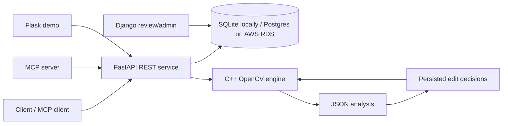

# Automated Video Trimmer (C++/OpenCV)

**Keep the continuous clear main shot between blurry sections.**

Matthew Tavares's original `Clip.cpp` algorithm is the editing core. It checks
Laplacian variance at half-second intervals, skips blurry footage and clear
sections that are too brief, then keeps the first sustained clear shot until
blur returns. The default blur threshold is **5** (intentionally tolerant).
Single-clip API analysis defaults to a four-second minimum; the automatic
multi-clip flows use a one-second minimum so every qualifying upload can join
the final edit. It does not rank isolated sharp frames or split the main shot
into arbitrary highlights.

`Clip.cpp`, `Clip.h`, and `VideoCompiler.cpp` were restored from the original
codebase at commit `d2b20e2`, with portability and boundary fixes described in
[docs/original-algorithm.md](docs/original-algorithm.md). Both the desktop
program and the JSON engine use this same `Clip` class. Python, FastAPI, SQL,
Django, Flask, MCP, Docker, CI/CD, and AWS are supporting layers around it.

## Original desktop workflow

After building with CMake, run `./build/VideoTrimmer`. Create or load a text
file whose first line is the clips directory and remaining lines are filenames.
The original Display / Edit / Render workflow exports `Test.avi` in the working
directory. Optional face-first selection uses a Haar cascade supplied through
`FACE_CASCADE_PATH`; without it, selection uses blur boundaries only.

## What it does

1. **Upload** a video to `POST /jobs`.
2. **Analyze** it with a headless C++/OpenCV executable. The engine accepts a
   JSON job specification and writes JSON analysis—no prompts, windows, or
   hardcoded file paths.
3. **Validate** the C++-selected cut against the requested minimum duration
   and maximum total duration. The Python service does not select replacement
   footage.
4. **Inspect status** at `GET /jobs/{job_id}`. Jobs and approved cut decisions
   are persisted in SQLite locally and can use Postgres in deployment.
5. **Export** an MP4 with `POST /jobs/{job_id}/export`.

## Architecture



The same diagram is available in [docs/architecture.md](docs/architecture.md).

## Choose an interface

The C++ selection algorithm is identical in all three interfaces. Choose the
one that matches the person using the project:

| Interface | Intended user | What they do |
| --- | --- | --- |
| [FastAPI `/docs`](#1-developer-test-page-fastapi-docs) | Developer / reviewer | Call and inspect each API operation directly. |
| [Flask website](#2-browser-website) | Regular browser user | Upload clips, click **Edit automatically**, download the result. |
| [Codex MCP](#3-codex-mcp) | Codex user | Ask Codex to edit clips in natural language. |

## Quick start

### Prerequisites

- Python 3.12+
- CMake 3.20+
- C++17 compiler
- OpenCV development package
- `nlohmann-json` development package

macOS example:

```bash
brew install cmake opencv nlohmann-json
python3 -m venv .venv
source .venv/bin/activate
pip install -r requirements.txt
cmake -S . -B build
cmake --build build --parallel
export VIDEO_ENGINE_BIN="$PWD/build/video_engine"
uvicorn api.app.main:app --reload
```

Keep this terminal running, then use one of the three interfaces below.

### 1. Developer test page: FastAPI `/docs`

Open `http://127.0.0.1:8000/docs`. This is FastAPI's interactive developer
test page, not the customer-facing website. Use **Try it out** to upload a
clip, copy its job ID, then call `analyze`, `export`, and download endpoints
while inspecting their JSON responses.

### Example single-clip API flow

```bash
# 1. Upload
curl -F "file=@sample.mp4" http://127.0.0.1:8000/jobs

# 2. Analyze (replace JOB_ID)
curl -X POST http://127.0.0.1:8000/jobs/JOB_ID/analyze \
  -H 'content-type: application/json' \
  -d '{"min_clip_seconds":4,"max_total_duration_seconds":8,"blur_threshold":5}'

# 3. Inspect the saved cut list
curl http://127.0.0.1:8000/jobs/JOB_ID

# 4. Render the approved decisions
curl -X POST http://127.0.0.1:8000/jobs/JOB_ID/export \
  -H 'content-type: application/json' \
  -d '{"output_name":"highlight.mp4"}'
```

### 2. Browser website

The Flask website is a small, functional browser client. It uploads one or
more clips to FastAPI, automatically analyzes/trims/joins qualifying clips,
and streams the finished download back to the browser. It contains no editing
logic of its own.

With Docker installed, start the complete local stack in a second terminal:

```bash
docker compose up --build
```

Open `http://127.0.0.1:8002/`, choose clips, optionally change the blur
threshold or maximum length, and click **Edit automatically**. A threshold of
**5** is the default; lower numbers allow more blur in the retained footage.

### 3. Codex MCP

The MCP server is a local `stdio` adapter over the FastAPI service. In a
second terminal, with the FastAPI server from Quick start still running:

```bash
cd /path/to/AI-Video-Editor
codex mcp add ai-video-editor \
  --env API_BASE_URL=http://127.0.0.1:8000 \
  -- "$PWD/.venv/bin/python" "$PWD/mcp_server/server.py"
codex mcp list
```

Restart Codex (or start a new Codex session) and use `/mcp` to confirm that
**ai-video-editor** is connected. Then give Codex a prompt such as:

```text
Use edit_videos to edit these clips for me:
/absolute/path/clip-one.mov
/absolute/path/clip-two.mov
```

Codex calls `edit_videos`, which uploads the clips, automatically analyzes and
trims every qualifying clip, then joins them into one MP4. It can also adjust
an existing upload: “allow a bit more blur and make the clip longer.” That
maps to `adjust_edit(blur_tolerance="more", clip_length="longer")`.

## Headless C++ engine

The engine is intentionally usable without Python:

```bash
./build/video_engine analyze --job job.json --output analysis.json
./build/video_engine render --job render.json --output export.json
```

`job.json` example:

```json
{
  "input_path": "/absolute/or/relative/path/to/input.mp4",
  "min_clip_seconds": 4,
  "max_total_duration_seconds": 8
}
```

The engine calls `Clip::Create`, which uses `Clip::FindNotBlurry`. It writes
source metadata, the sampled blur measurements, and the selected main shot to
JSON. `render.json` adds `output_path` and the accepted `cuts`. Optional
`face_cascade_path` enables the original face-first adjustment within that shot.

A clear section shorter than the minimum produces an empty cut list, not an
invented highlight. For footage with a roughly three-second clear section,
explicitly use `"min_clip_seconds": 2`. The default remains four seconds.
If the selected shot exceeds the maximum, the original centered trim with a
random target length is retained. Sampling remains the original half-second
cadence; `sample_interval_seconds` is no longer a selection setting.

## Django, Flask, and Docker

```bash
docker build -t ai-video-editor .
docker run --rm -p 8000:8000 -v "$PWD/data:/data" ai-video-editor
```

For the complete local stack—FastAPI, PostgreSQL, Django review/admin, and the
small Flask dashboard—run:

```bash
docker compose up --build
```

- FastAPI developer test page: `http://127.0.0.1:8000/docs`
- Django review/admin: `http://127.0.0.1:8001/`
- Flask browser website: `http://127.0.0.1:8002/`

Django's models are intentionally read-only views of the FastAPI SQL tables;
there is one job record and one source of editing decisions.

## AWS and CI/CD

For AWS deployment, follow [aws/elastic-beanstalk/README.md](aws/elastic-beanstalk/README.md).
The current Elastic Beanstalk environment runs the FastAPI/C++ container. For
a shared production service, add S3 for original videos and exports, RDS
PostgreSQL for jobs and decisions, authentication, and a hosted HTTPS MCP
endpoint; local container storage is not durable across deploys. The
GitHub Actions CI workflow tests the native core, Python API, Django, Flask,
MCP package, and Docker image on every push and pull request. The separate AWS
workflow is a template for publishing an immutable image to ECR and rolling a
configured ECS service when `main` changes; configure its documented GitHub
environment variables and OIDC role before enabling it.

The Elastic Beanstalk nginx configuration accepts uploads up to 100 MB. For
larger production files, use direct-to-S3 multipart uploads instead of routing
the media through the API server.

## Quality checks

```bash
pytest api/tests -q
cmake -S . -B build && cmake --build build --parallel
ctest --test-dir build --output-on-failure
docker build -t ai-video-editor .
```

GitHub Actions runs these checks on every push and pull request.

## Delivery plan

- **Sprint 1 — reliable editing core:** engine JSON contract, API job lifecycle,
  SQLite persistence, and tests.
- **Sprint 2 — delivery surfaces:** Django review/admin, Flask demo, MCP,
  Docker Compose, AWS deployment, and durable media storage.

Suggested GitHub issues are in [docs/backlog.md](docs/backlog.md).

## Important limitations

- This is an editing assistant, not a replacement for professional NLE tools.
- OpenCV export writes video frames only; preserving/remixing audio is the next
  production milestone and should use FFmpeg.
- Selection uses the original blur state machine, not semantic understanding
  of the action. Half-second sampling gives approximate blur boundaries;
  scene or speech features must remain optional additions to this core.

## License

See [LICENSE](LICENSE).
