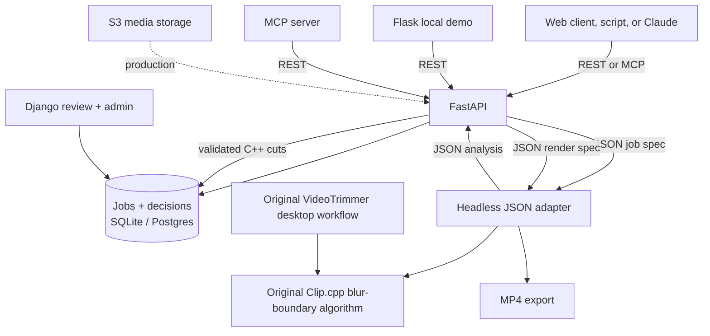

# Architecture

## Boundaries

- **Clip.cpp:** the original sequential blur detector and main-shot selection.
  The headless engine and original desktop workflow both use this class.
- **C++ engine:** JSON access to that selection and rendering. It never knows
  about HTTP, SQL, LLMs, or fixed filesystem locations.
- **FastAPI:** upload validation, job lifecycle, SQL persistence, and the API
  contract shared with Flask and MCP. It validates, but never replaces, the
  C++-selected cut.
- **Django:** read-only job review and Django Admin on the same SQL tables.
- **Flask:** a deliberately small local/demo dashboard that calls FastAPI.
- **MCP:** a thin client-facing adapter; it invokes REST rather than duplicating
  business logic.
